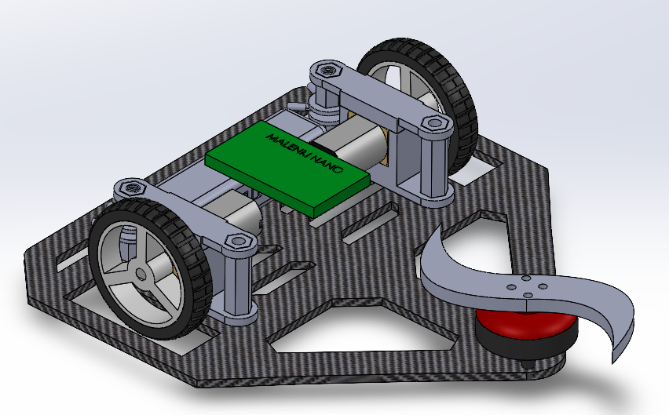

  
    

  

## Problem

As a personal challenge, and as a lover of the TV show battlebots, I decided to join the Melbourne Combat Robotics League antweight division.

## Approach

I built a tank driven horizontal spinner. I used a variety of resources and materials to construct this. 
The chassis is carbon fibre composite, which I chose after observing the amount of force the motor and weapon impart upon impact. The weapon is titanium, 4mm thick, which was cut on a CNC router. 

## Result

There have been many design challenges, problems and setbacks. This design has evolved over the two competitions I have participated in, and will be put to the test in the upcoming competition.

## What I'd do differently

Replaced the on-switch screw properly.
